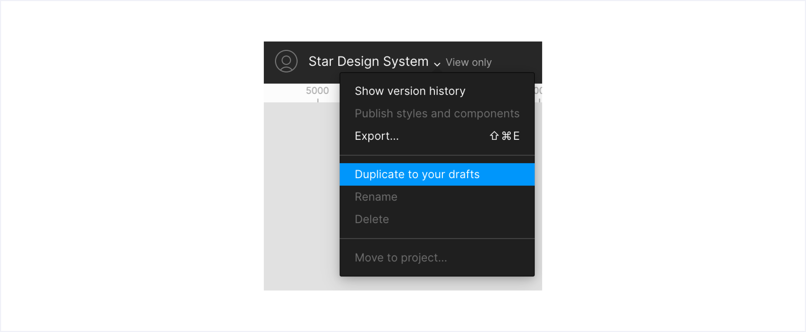

# Auto layout

Todos nuestros experimentos están montados con **Auto layout**, porque de esta manera podemos simular como se va a **adaptar** en el caso de que alguna de sus partes sea alterada, ya sea por cualquier **modificación**.

En este caso vemos como al modificar el ancho de este experimento se adapta no solo la caja que lo contiene, sí no que también lo hacen los textos, líneas, imagen y botón.

Como podemos ver en este caso si quitamos partes como el head o el título, el contenido se adapta, pero lo hace hacia arriba porque la x que tenemos en la parte superior es flotante y esa se puede montar con autolayout.

Tener esta "x" flotante es muy común en los experimentos y para solucionar este pequeño "bug", lo que hacemos es que cuando quitamos alguna parte del experimento hacemos click en el icono de _Resize to fit_  . Esto ajustará el tamaño del frame al tamaño actual del contenido, por último solo tenemos que alinear el experimento a la zona donde estaba con las opciones de alineación en la parte superior  , en este caso abajo a la izquierda.

Montar los experimentos con Auto layout nos permite poder ocultar partes del componente como hemos visto en estos ejemplos y esto ayuda mucho a que desarrollo pueda saber como se va a comportar algo en el caso de que growth decida no añadir alguna parte. Recordar que siempre podéis duplicar el documento para probar sin afectar al documento original, junto al nombre podéis desplegar las opciones del fichero, entre estas opciones, pulsáis en "Duplicate to your drafts" y tendréis una copia.

