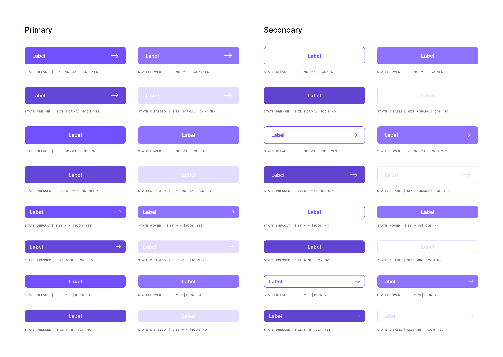
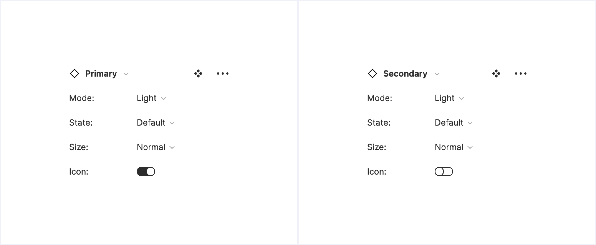

# Componentes

Los componentes **son elementos reutilizables**. Como podemos ver en la metodología de [Atomic Design de Brand Frost](https://bradfrost.com/blog/post/atomic-web-design/), estos elementos fundacionales se combinan para construir otros más complejos, por lo que podemos tener tanto **componentes básicos**, como **componentes complejos** formados por otros más básicos.

Pensemos en estos como piezas de Lego, podemos tener varias de diferentes tamaños, formas y propósito. Pero a pesar de que no todas sean iguales, podemos combinarlas entre sí y formar algo mucho más complejo. De esta misma manera tenemos que ver a los componentes, como **elementos que pueden funcionar por separado pero también en conjunto**.&#x20;

Los componentes se combinan para solucionar necesidades que pueda tener producto y poder generar una interfaz a partir de ello. Esta forma de trabajo aporta mucho tanto a diseño como a desarrollo, que empieza a trabajar de la misma manera, trabajando de forma conjunta, podemos **continuar evolucionando** todo el sistema, siendo este **el eje sobre el que se crea todo el producto**.

### Gestión de componentes

Por lo general tenemos dos tipos de cada componente básico, uno primario y otro secundario, esto se podrá definir de otra manera en componentes más complejos. Según las necesidades que pueda tener dicho componente podemos tener distintas variantes como pueden ser el modo, estado, tamaño, etc...

Estas variantes se crean de manera que el primer componente de cada variante debe contener todo lo necesario para poder formar las otras variantes, este se define como **componente master**. Como en este caso tienen que trabajar tanto en modo light, como en modo dark, dentro de las variantes tenemos dos master, uno para light y otro para dark.

Para mostraros como funciona en detalle, pondremos de ejemplo el componente _Buttons_, del cual tenemos primary y secondary con distintas variantes.&#x20;

Como podéis ver, tenemos 16 variantes del primary y otras 16 del secondary, más las mismas pero para el modo dark. Esto haría un total de **64 variantes** solo para los dos tipos de botones que tenemos. Si en algún momento se decide cambiar algo de los botones tendríamos que hacerlo en todas las variantes, por esta razón creamos un master, por lo que si yo añado algo nuevo, todas las demás variantes también lo tendrán disponible. De esta manera creamos los botones, si os fijáis en el primary, tenemos el color principal, un label, un icono y un padding. Las otras variantes según cambien una de estas propiedades, forman una variante, las cuales tenemos organizadas de manera que puedas seleccionar cada una de ellas según lo necesites.


¡Importante! Tenemos que ser muy cuidadosos en el caso de cambiar algo en algún componente, porque esto no solo afectará a la parte visual de sistema de diseño, sino que también a todos los experimentos que hacen uso de ella.


Tenemos definidas todas estas opciones para los buttons tanto primarios como secundarios y el diseñador solo tiene que seleccionar uno de los dos.

* Mode
  * **Light**
  * **Dark**
* State
  * **Default**
  * **Hover**
  * **Pressed**
  * **Disabled**
* Size
  * **Normal**
  * **Mini**
* Icon
  * **Yes**
  * **No**


Esta forma de organización está en continua evolución y en un futuro se tiene planteado crear estos componentes interactivos, por lo que puede tener algún cambio. (aun en beta por Figma)

