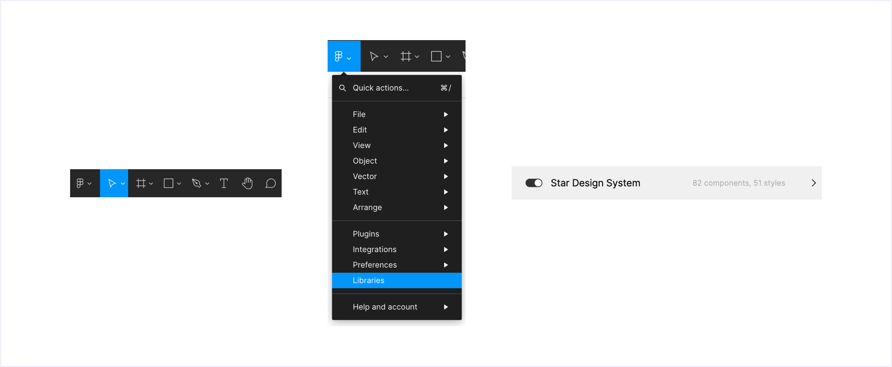

# Librería

"**Star Design System**" es la librería compartida con todo el equipo para poder compartir todos los estilos y componentes de **Star DS.**

En esta subimos todo Star DS, y según vamos haciendo cambios los publicamos para que se pueda utilizar en todos los experimentos. Es importante no desvincular el componente de la librería haciendo "Detach" porque si lo hacemos ese componente dejará de recibir las actualizaciones de la librería.

Para poder utilizarla es necesario activarla, para ello tenemos que hacer click en el Menú de Figma (logo a la izquierda en la barra superior), después en "Libraries" y por último activar el switch de "Star Design System".

Cuando realicemos un cambio en la librería nos aparecerá la notificación de la izquierda, una vez publicados en los ficheros a los que afecte estos cambios nos aparecerá la notificación de la derecha, con darle a "Review" y confirmar los cambios ya tendremos actualizada la librería 😄.


Por último, como ya comentamos en la parte de componentes tenemos que ser cuidadosos al cambiar algo en algún componente porque esto podría afectar a algún experimento que esté usándolo, hace poco detectamos algunos puntos a tener en cuenta al cambiar una caja de texto, que en algunos puntos perdíamos el texto escrito con anterioridad:

* Cambio unicamente de texto en componente master (no afecta al texto)
* Cambio unicamente de color del texto (no afecta al texto)
* Remplazar texto por otro o un duplicado de otro (si afecta al texto)
* Cambio de posiciones de texto dentro de un autolayout (no afecta al texto)
* Duplicar el texto dentro de un autolayout no afecta al texto añadido pero el nuevo volverá al texto por original del componente (afecta al nuevo texto creado pero no al que ya existía)

