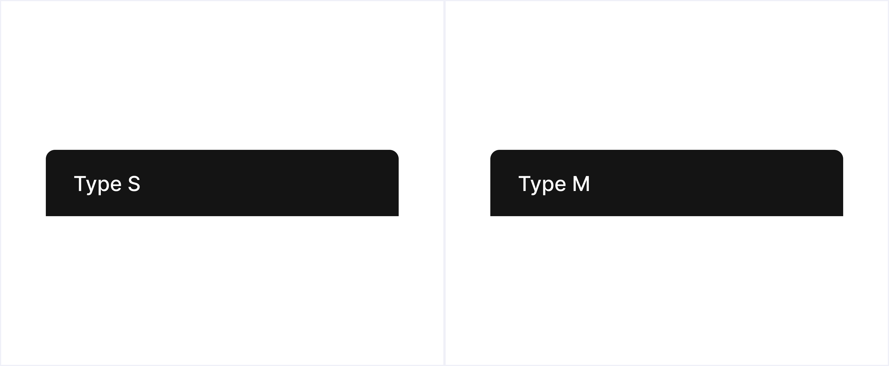

# Tipografía

Tenemos las tipografías agrupadas en dos tipos, **Type S** & **Type M**. Lo tenemos de esta manera para simplificar la forma en la que se trabaja con ellas y por que si dábamos libertan en esta parte, la persona que trabaje con ello puede no ser diseñador y esto afectar a la parte visual.

Dentro de cada tipo, tenemos distintos tamaños, desde títulos a etiquetas. Estas se nombran según que función tienen, a continuación se describen las propiedades de cada una:

| Supertitle S                                                                                                                                                             | Supertitle M                                                                                                                                                             |
| ------------------------------------------------------------------------------------------------------------------------------------------------------------------------ | ------------------------------------------------------------------------------------------------------------------------------------------------------------------------ |
| 

<ul><li>Size: <strong>32px</strong></li><li>Line-height: <strong>40px</strong></li><li>Weight: <strong>Medium</strong> &#x26; <strong>Semibold</strong></li></ul> | 

<ul><li>Size: <strong>40px</strong></li><li>Line-height: <strong>48px</strong></li><li>Weight: <strong>Medium</strong> &#x26; <strong>Semibold</strong></li></ul> |

| Title S                                                                                                                                                                  | Title M                                                                                                                                                                  |
| ------------------------------------------------------------------------------------------------------------------------------------------------------------------------ | ------------------------------------------------------------------------------------------------------------------------------------------------------------------------ |
| 

<ul><li>Size: <strong>24px</strong></li><li>Line-height: <strong>32px</strong></li><li>Weight: <strong>Medium</strong> &#x26; <strong>Semibold</strong></li></ul> | 

<ul><li>Size: <strong>32px</strong></li><li>Line-height: <strong>40px</strong></li><li>Weight: <strong>Medium</strong> &#x26; <strong>Semibold</strong></li></ul> |

| Description S                                                                                                                                                                                  | Description M                                                                                                                                                                                  |
| ---------------------------------------------------------------------------------------------------------------------------------------------------------------------------------------------- | ---------------------------------------------------------------------------------------------------------------------------------------------------------------------------------------------- |
| 

<ul><li>Size: <strong>16px</strong></li><li>Line-height: <strong>24px</strong></li><li>Weight: <strong>Regular</strong>, <strong>Medium</strong> &#x26; <strong>Bold</strong></li></ul> | 

<ul><li>Size: <strong>16px</strong></li><li>Line-height: <strong>24px</strong></li><li>Weight: <strong>Regular</strong>, <strong>Medium</strong> &#x26; <strong>Bold</strong></li></ul> |

| Component S                                                                                                                                                                                    | Component M                                                                                                                                                                                    |
| ---------------------------------------------------------------------------------------------------------------------------------------------------------------------------------------------- | ---------------------------------------------------------------------------------------------------------------------------------------------------------------------------------------------- |
| 

<ul><li>Size: <strong>16px</strong></li><li>Line-height: <strong>24px</strong></li><li>Weight: <strong>Regular</strong>, <strong>Medium</strong> &#x26; <strong>Bold</strong></li></ul> | 

<ul><li>Size: <strong>18px</strong></li><li>Line-height: <strong>26px</strong></li><li>Weight: <strong>Regular</strong>, <strong>Medium</strong> &#x26; <strong>Bold</strong></li></ul> |

| Tag S                                                                                                                                                                                           | Tag M                                                                                                                                                                                          |
| ----------------------------------------------------------------------------------------------------------------------------------------------------------------------------------------------- | ---------------------------------------------------------------------------------------------------------------------------------------------------------------------------------------------- |
| 
 
<ul><li>Size: <strong>14px</strong></li><li>Line-height: <strong>22px</strong></li><li>Weight: <strong>Regular</strong>, <strong>Medium</strong> &#x26; <strong>Bold</strong></li></ul> | 

<ul><li>Size: <strong>14px</strong></li><li>Line-height: <strong>22px</strong></li><li>Weight: <strong>Regular</strong>, <strong>Medium</strong> &#x26; <strong>Bold</strong></li></ul> |


Estos tamaños pueden variar o se puede añadir alguno más en algún momento, según se necesite. Pero la idea sigue siendo tener lo mínimo posible, solo lo necesario.

